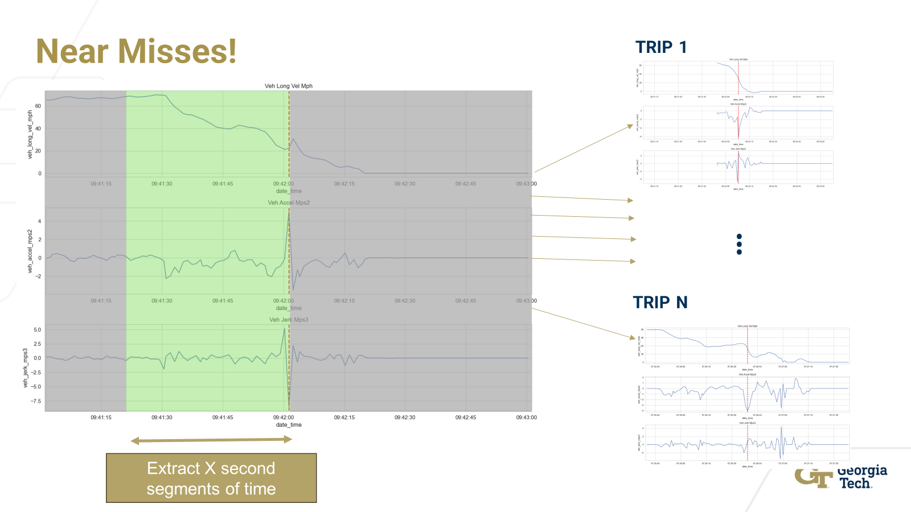

# Near Miss Algorthm Development: MASS-Based Time Series Analysis for Vehicle Dynamics Data

## Overview
This repository aims to enhance the efficiency and applicability of the MASS (Mueen's Algorithm for Similarity Search) function to detect near-miss sequences and analyze complete trips based on vehicle dynamics data recorded at 1 Hz. The current approach involves iterating on the MASS algorithm to handle specific use cases related to vehicle dynamics, focusing on patterns of driving behavior, the influence of braking intensity, and accounting for differences in driving modes.



## Objectives
The main goals of this project are:
1. **Scale Sensitivity**: Modify the MASS algorithm to incorporate the magnitude of certain features, such as the intensity of braking, beyond the typical pattern matching.
2. **Feature Weighting**: Develop a method to fairly weigh each feature in the dataset, ensuring variables that are not z-normalized contribute appropriately to the distance profile.
3. **Categorical Data Handling**: Extend MASS to handle categorical data such as drive modes, ensuring that features like braking assist or cruise control modes contribute meaningfully to the distance profile.
4. **Dynamic Time Warping (DTW)**: Explore the use of DTW to allow for similarity searches between sequences that occur at different rates or speeds.
5. **Latent Space Analysis**: Optionally perform analysis in a lower-dimensional latent space to evaluate potential improvements in performance and computational efficiency.

## Background
MASS (Mueen's Algorithm for Similarity Search) is a highly efficient approach to compute distance profiles between a query and a time series, typically using z-normalized Euclidean distance. This allows us to identify similar subsequences effectively, making it a foundational tool for time series data mining.

In our use case, we aim to analyze vehicle dynamics data from Ford Insure, looking for near-miss events and specific driver behaviors. We seek to develop an extended MASS function to overcome some limitations in the original implementation and enhance its capabilities, such as fair feature weighting and handling of categorical data. By improving MASS, we hope to improve the ability to detect patterns in driving behavior that could signal a near-miss or indicate potential risks.

## Key Resources
1. [VLDB 2023: Time Series Data Mining - A Unifying View by Eamonn Keogh](https://www.cs.ucr.edu/~eamonn/Hot_paths_to_anomaly_detection_with_TIBCO_data_science,_streaming_on_AWS_AIM201-S.pdf)
2. [MASS: Distance Profile of a Query Over a Time Series - Data Mining and Knowledge Discovery, 2024](https://doi.org/10.1007/s10618-024-01005-2)
3. [Mueen's Fast Similarity Search Algorithm (MASS)](http://www.cs.unm.edu/~mueen/FastestSimilaritySearch.html)
4. [Python Implementation of MASS written by Tyler Marrs](https://github.com/tylerwmarrs/mass-ts)

These resources provide comprehensive background on MASS, its applications, and its efficiency for computing distance profiles in time series data mining. The project aims to build upon these existing works by incorporating additional considerations specific to vehicle dynamics and safety analysis.

## Installation
To set up this project locally, clone the repository and install the required dependencies:
```bash
$ git clone https://github.com/DonavenLobo/FordxGatech_NearMissAlgo_Devv.git
# $ pip install -r requirements.txt 
```

## Project Structure
- **mass_algos/**: Contains the previously developed core functions for the MASS implementation and extensions.
- **notebooks/**: Jupyter notebooks to illustrate the development and evaluation of the proposed extensions.
- **data/**: dataset to benchmark development (not included for privacy).
- **papers/**: PDFs of the papers detailing MASS.


## Contributing
Contributions are welcome! Please create a pull request with a clear explanation of the changes you propose. Make sure to include relevant tests for new features or modifications.

## License
This project is currently not licensed under anything.

## Contact
For questions or suggestions, feel free to reach out through GitHub or contact [Donaven Lobo](mailto:dlobo6@gatech.edu).

## Acknowledgments
This project builds upon foundational work in time series data mining by Eamonn Keogh and Abdullah Mueen. We acknowledge their contributions to the development of time series similarity search techniques.

